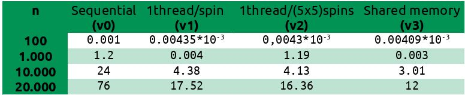

# Ising model implementation in CUDA
_Excercise for the Parallel & Distributed Computer Systems course, school of Electrical and Computer Enginneering, AUTH_  
_December of 2019_

The [Ising model](https://en.wikipedia.org/wiki/Ising_model) (/ˈaɪsɪŋ/; German: [ˈiːzɪŋ]), named after the physicist Ernst Ising, is a mathematical model of ferro-magnetism in statistical mechanics. The model consists of discrete magnetic dipole moments of atomic “spins” that can be in one of two states (+1 or −1). The spins are arranged in a square lattice with periodic boundary conditions, allowing each spin to interact with its neighbors. The dipole moments update in discrete time steps according to the majority of the spins within the 3 × 3 window centered to each lattice point. Windows centered on the edge lattice points wrap around to the other side (known as toroidal or periodic boundary conditions).

## Project description
CUDA implementation of the evolution of an Ising model in two dimensions for a given number of steps `𝑘`. For this implementation, we assume that the window has size of 5 × 5, and 4 different versions are constructed and compared to each other:
* **V0: Sequential version:** A basic CUDA-free version useful for testing against the performance of the CUDA versions.
* **V1: GPU with one thread per moment:** The kernel function computes the spin of a single moment.
* **V2: GPU with one thread computing a block of moments:** This is a slower version, but is an itermediate step for the V3.
* **V3: GPU with multiple thread sharing common input moments:** Use of shared memory so that threads read more times from the shared memory instead of the main memory.

## Results
The following table gives measured execution times for the 4 different versions and variable problem sizes. The [full report](report.odt) is available in greek. Times are measured in seconds. 

